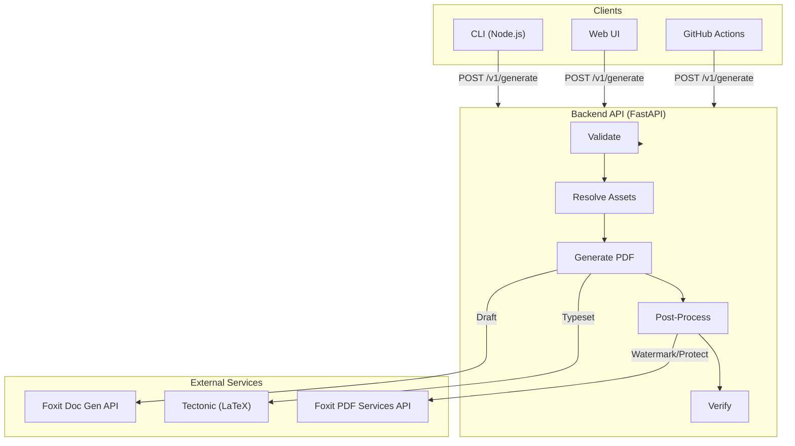
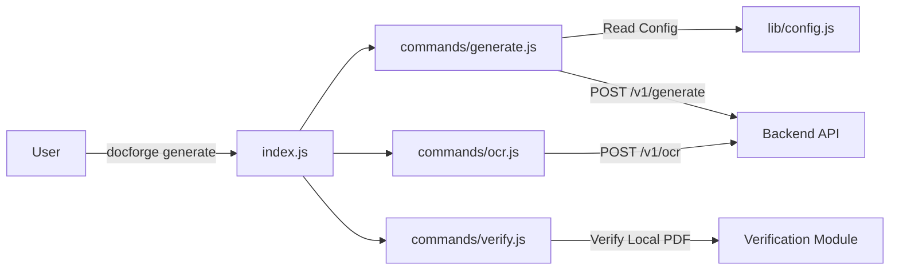
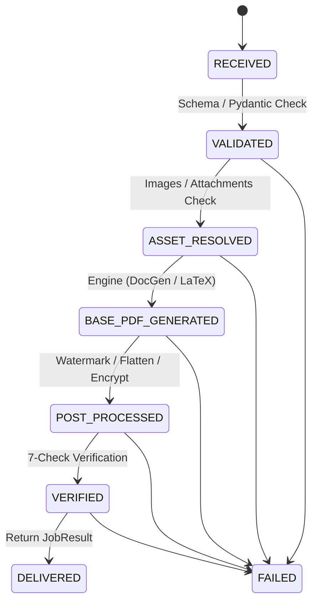

# DocForge CLI

**Turn release JSON, images, or scanned documents into polished, verified, watermarked PDFs — powered by Foxit Document Generation + PDF Services APIs.**

---

## Problem

Dev teams waste hours manually formatting release notes. Copy-pasting from GitHub into Word, adding branding, exporting to PDF — tedious, error-prone, inconsistent. Scanned docs and screenshots get lost. There's no verification that the final PDF was processed correctly.

## Solution

DocForge CLI automates the entire workflow with four modes:

1. **JSON → PDF** — Structured release data becomes a professionally formatted PDF via Foxit Document Generation API
2. **LaTeX → PDF** — Same JSON, typeset-quality output via tectonic for engineering/research teams
3. **Image → PDF** — Upload screenshots or diagrams, convert to a single PDF
4. **Scan → JSON → PDF** — OCR extracts text from scanned docs, structures it into release JSON, then generates a PDF

Every PDF passes through the **Foxit PDF Services API** for watermarking, flattening, and password protection — then a 7-check verification module proves the post-processing was applied correctly.

---

## End-to-End Workflow

```
Input (JSON / Image / Scan)
  │
  ├─ 1. Validate — Pydantic models + JSON Schema validation
  ├─ 2. Resolve Assets — Images/attachments with security checks
  ├─ 3. Generate — Choose engine:
  │     ├─ docgen → Foxit Document Generation API
  │     └─ latex  → tectonic (sandboxed)
  ├─ 4. Post-Process — Foxit PDF Services API:
  │     ├─ Upload
  │     ├─ Watermark (INTERNAL / DRAFT / CONFIDENTIAL)
  │     ├─ Flatten
  │     └─ Password-protect (optional)
  ├─ 5. Verify — 7 automated checks:
  │     ├─ PDF opens and parses
  │     ├─ Text content present
  │     ├─ Watermark on all pages
  │     ├─ Encryption flags correct
  │     ├─ Flattening confirmed
  │     ├─ Page count stable
  │     └─ Content hash (SHA-256)
  └─ 6. Deliver — PDF + full JobResult metadata
```

---

## Where Foxit APIs Are Used

### Foxit Document Generation API

**What:** Generates a Release Notes PDF from a Word template + JSON data.

**Why:** Converts structured release data (features table, bug fixes table, breaking changes, links) into a professionally formatted PDF. All driven by a `.docx` template with Foxit's token syntax (`{{ productName }}`, `{{TableStart:features}}`).

- **Endpoint:** `POST {HOST}/document-generation/api/GenerateDocumentBase64`
- **Input:** Base64-encoded Word template + JSON document values
- **Output:** Base64-encoded PDF (synchronous)
- **Code:** [`backend/app/foxit/docgen.py`](backend/app/foxit/docgen.py)

### Foxit PDF Services API

**What:** Post-processes every PDF through 4 operations — regardless of which engine generated it.

| Operation | Endpoint | Why |
|-----------|----------|-----|
| **Upload** | `POST /api/documents/upload` | Stage the PDF for server-side processing |
| **Watermark** | `POST /api/documents/enhance/pdf-watermark` | Stamp text diagonally across every page |
| **Flatten** | `POST /api/documents/modify/pdf-flatten` | Lock annotations for archival |
| **Protect** | `POST /api/documents/security/pdf-protect` | Encrypt with a password |
| **Download** | `GET /api/documents/{id}/download` | Retrieve the processed PDF |

Each operation is async (task-based with polling). The pipeline retries once on transient failure.

- **Code:** [`backend/app/foxit/pdfservices.py`](backend/app/foxit/pdfservices.py)
- **Pipeline orchestrator:** [`backend/app/foxit/pipeline.py`](backend/app/foxit/pipeline.py)

---

## API Endpoints

| Method | Path | Description |
|--------|------|-------------|
| `POST` | `/v1/generate` | Release JSON → verified PDF (with full JobResult metadata) |
| `POST` | `/v1/image-to-pdf` | Image(s) → PDF via Foxit Services |
| `POST` | `/v1/verify` | Run 7-check verification on an existing PDF |
| `POST` | `/v1/ocr/extract` | Image/PDF → extracted text with confidence scores |
| `POST` | `/v1/ocr/structurize` | Raw text → structured release JSON draft |
| `GET` | `/v1/templates` | List available templates |
| `GET` | `/health` | Health check |

### Generate endpoint response

The `/v1/generate` endpoint returns the PDF as the body and a base64-encoded `X-DocForge-Job` header containing the full `JobResult`:

```json
{
  "job_id": "e946b1ff8dd1",
  "engine_used": "latex",
  "input_hash": "8efb3557...",
  "artifact": {
    "filename": "acme-platform-v2.4.0-release-notes.pdf",
    "size_bytes": 20949,
    "pages": 1,
    "content_hash": "3836aac5..."
  },
  "timings": [
    { "step": "validate", "duration_ms": 0, "status": "ok" },
    { "step": "resolve_assets", "duration_ms": 0, "status": "skipped" },
    { "step": "generate", "duration_ms": 575, "status": "ok" },
    { "step": "post_process", "duration_ms": 5920, "status": "ok" },
    { "step": "verify", "duration_ms": 93, "status": "ok" }
  ],
  "verification": {
    "checks_passed": 7,
    "checks_total": 7,
    "passed": true,
    "watermark_detected": true,
    "watermark_on_all_pages": true,
    "is_encrypted": false,
    "flattening_signals": true
  },
  "diff_summary": {
    "watermark_applied": true,
    "flattened": false,
    "password_protected": false,
    "size_change_bytes": 1298
  }
}
```

---

## How to Run Locally

### Prerequisites

- Python 3.12+, Node.js 18+
- Free Foxit developer account → [sign up here](https://app.developer-api.foxit.com/pricing)
- Optional: `tectonic` for LaTeX engine (`brew install tectonic`)
- Optional: `tesseract` for OCR (`brew install tesseract`)

### Quick start

```bash
git clone https://github.com/YOUR_USERNAME/docforge-cli.git
cd docforge-cli
make setup                    # installs all deps, creates .env
# Edit backend/.env with your Foxit API credentials
make backend                  # start API server on :8000 (leave running)

# In a second terminal — pick your mode:

# Mode 1: CLI
cd cli && npm install
node src/index.js generate ../examples/release.json --watermark DRAFT --engine latex --verify

# Mode 2: Web Demo
open http://localhost:8000    # landing page with all 4 modes

# Mode 3: cURL
curl -X POST http://localhost:8000/v1/generate \
  -H "Content-Type: application/json" \
  -d @examples/release.json \
  -o release-notes.pdf
```

### Manual setup

```bash
# Backend
cd backend
python3 -m venv .venv && source .venv/bin/activate
pip install -r requirements.txt
cp .env.example .env           # edit with your Foxit credentials
uvicorn app.main:app --reload  # starts on http://localhost:8000

# CLI (in another terminal)
cd cli && npm install
node src/index.js generate ../examples/release.json --out output.pdf
```

---

## CLI Reference

```
docforge generate <input.json> [options]

Options:
  -o, --out <path>         Output PDF path (auto-generated if omitted)
  -w, --watermark <text>   Watermark text (default: INTERNAL)
  -p, --password <pwd>     Password-protect the PDF
  -e, --engine <type>      Engine: docgen | latex (default: docgen)
  -t, --template <id>      Template: product-release | security-advisory | api-release
  -v, --verify             Run 7-check post-processing verification
  --open                   Open PDF in system reader after generation
  --json                   Output full job metadata as JSON to stdout

docforge templates          List available templates

docforge verify <pdf> [options]
  -w, --watermark <text>   Expected watermark text (default: INTERNAL)
  --encrypted              Expect the PDF to be encrypted
  --json                   Output verification result as JSON

docforge ocr <file> [options]
  -s, --structurize        Also convert extracted text to release JSON
  -o, --out <path>         Save extracted text or JSON to file
  --json                   Output raw result as JSON
```

### Example with all flags

```bash
docforge generate release.json \
  --engine latex \
  --watermark CONFIDENTIAL \
  --password s3cret \
  --verify \
  --open
```

Output:

```
  ✓ PDF generated for Acme Platform v2.4.0

  Output:    acme-platform-v2.4.0-release-notes.pdf
  Size:      25.5 KB
  Engine:    latex
  Pipeline:  8392 ms
  Verify:    ✓ 7/7 checks passed
  Pages:     2
  Hash:      40c162c27a74fe899b06...

  Step Timings:
    ✓ validate           0ms
    ⊘ resolve_assets     0ms  no assets
    ✓ generate           908ms  latex → 24795 bytes
    ✓ post_process       7285ms  watermark=CONFIDENTIAL password=yes
    ✓ verify             169ms  7/7 checks
```

---

## Architecture

### Overall System Architecture



### Frontend Architecture (CLI)



### Backend Architecture (Job Orchestrator)

The pipeline runs as a state machine with per-step timing and structured logging:



---

## Templates

Three templates ship out of the box. List them with `docforge templates` or `GET /v1/templates`.

| Template | Default Watermark | Best for |
|----------|-------------------|----------|
| `product-release` | INTERNAL | Standard product releases with features, fixes, breaking changes |
| `security-advisory` | CONFIDENTIAL | Security patches with CVE references |
| `api-release` | DRAFT | API changelogs with endpoint changes and deprecations |

---

## OCR Pipeline (Scan → JSON → PDF)

DocForge can extract structured release data from screenshots or scanned documents:

1. **Upload** an image or scanned PDF to `POST /v1/ocr/extract`
2. **Extract** — Tesseract OCR produces text with per-line confidence scores
3. **Structurize** — Pattern-based extractor finds product name, version, features, fixes, breaking changes via `POST /v1/ocr/structurize`
4. **Review** — Quality gates based on confidence:
   - **> 90%** — auto-populate, allow one-click generation
   - **70–90%** — populate with warnings, require user confirmation
   - **< 70%** — force manual review, block auto-generation
5. **Generate** — Feed the reviewed JSON into the normal pipeline

---

## Verification Module

Every generation can include automated verification (enabled by default in the web UI, opt-in with `--verify` in the CLI):

| Check | What it verifies |
|-------|-----------------|
| Opens & parses | PDF is valid and readable |
| Has text | Content was rendered (not blank pages) |
| Watermark detected | Watermark text found in the PDF |
| Watermark all pages | Watermark present on every page |
| Encryption matches | Password protection applied if requested |
| No annotations | Flattening removed interactive elements |
| Content hash | SHA-256 for deterministic proof |

Results are included in the `JobResult` and displayed in both the CLI and web UI.

---

## Data Handling

**No data is stored.** Input JSON is processed in memory and discarded after the PDF is returned. No files are written to disk on the server. No user data is logged — only request IDs and byte sizes.

**Security controls:**

- File uploads: 10MB per-file limit, type allowlist (jpg/png/gif/pdf/txt)
- Asset paths: traversal blocked, only relative paths allowed
- LaTeX: sandboxed in temp directory, shell-escape disabled, 60s timeout
- OCR: images processed in memory, no persistence
- Logging: no payloads logged, only job IDs and sizes

---

## Project Structure

```
docforge-cli/
├── README.md
├── LICENSE
├── Makefile                             # make setup / backend / demo
├── render.yaml                          # Render deployment config
├── schemas/
│   └── release.schema.json              # JSON Schema for input validation
├── templates/
│   ├── release-notes.tex                # LaTeX reference template
│   ├── release-notes.template.json      # DocGen template definition
│   └── presets/
│       ├── product-release.json         # Example: product release
│       ├── security-advisory.json       # Example: security patch
│       └── api-release.json             # Example: API changelog
├── examples/
│   └── release.json                     # Sample input
├── backend/
│   ├── Dockerfile
│   ├── requirements.txt
│   └── app/
│       ├── main.py                      # FastAPI routes (7 endpoints)
│       ├── errors.py                    # Structured error catalog (12 types)
│       ├── core/
│       │   └── config.py                # Config + credential validation
│       ├── models/
│       │   ├── release.py               # ReleaseModel + sub-models (Pydantic)
│       │   └── job.py                   # JobResult, StepTiming, Verification
│       ├── foxit/
│       │   ├── auth.py                  # Foxit API auth headers
│       │   ├── docgen.py                # Document Generation API client
│       │   ├── texgen.py                # LaTeX engine (tectonic, sandboxed)
│       │   ├── pdfservices.py           # PDF Services API client (with retries)
│       │   └── pipeline.py              # Job Orchestrator (state machine)
│       ├── pdf/
│       │   ├── verify.py                # 7-check PDF verification module
│       │   └── image_to_pdf.py          # Image → PDF converter
│       ├── ocr/
│       │   ├── extract.py               # Tesseract OCR extraction
│       │   └── structurize.py           # Text → release JSON extractor
│       ├── pipeline/
│       │   ├── resolve_assets.py        # Asset resolution + security
│       │   └── appendix.py              # Appendix builder (LaTeX + text)
│       ├── templates/
│       │   └── registry.py              # Template registry (3 templates)
│       └── utils/
│           ├── logging.py               # Step logger with durations
│           └── validate.py              # Input validation
├── cli/
│   ├── package.json
│   └── src/
│       ├── index.js                     # CLI entry (generate, verify, ocr, templates)
│       ├── commands/
│       │   ├── generate.js              # generate command (--verify, --open, --json)
│       │   ├── verify.js                # verify command (7-check PDF validation)
│       │   └── ocr.js                   # ocr command (--structurize, --out)
│       └── lib/
│           ├── apiClient.js             # HTTP client + job metadata parsing
│           └── config.js                # Config
├── docs/
│   ├── index.html                       # Landing page (4-mode demo)
│   └── IMPLEMENTATION_PLAN.md           # Solution architecture document
├── tests/
│   ├── conftest.py                      # Shared fixtures
│   ├── unit/                            # Unit tests (8 test files)
│   ├── integration/                     # API contract + pipeline tests
│   ├── golden/                          # Golden tests for template/engine combos
│   └── corpus/json/                     # Test inputs (minimal, unicode, empty)
├── .githooks/
│   └── pre-push                         # Auto-generate draft on release.json change
├── pyproject.toml                       # pytest config
└── .github/workflows/
    ├── release-notes.yml                # Generate PDF on GitHub Release
    ├── release-notes-on-merge.yml       # Generate PDF on merge to main
    └── release-notes-pr.yml             # Draft PDF preview on PR
```

---

## Deployment

### Render (recommended)

```bash
# render.yaml is included — connect your GitHub repo to Render
# and it auto-deploys the backend with the landing page.
```

### Docker

```bash
cd backend
docker build -t docforge-api .
docker run -p 8000:8000 --env-file .env docforge-api
```

---

## Tech Stack

| Component | Technology |
|-----------|------------|
| Backend | Python 3.12, FastAPI, httpx, python-docx, Pydantic v2 |
| CLI | Node.js 20, Commander.js, Axios, Chalk, Ora |
| PDF Generation | Foxit Document Generation API |
| LaTeX Engine | tectonic (sandboxed, 60s timeout, no shell-escape) |
| PDF Processing | Foxit PDF Services API |
| PDF Verification | pymupdf (fitz) — local, no API calls |
| OCR | Tesseract + pytesseract + Pillow |
| Input Validation | JSON Schema (draft 2020-12) + Pydantic |
| Landing Page | Tailwind CSS, vanilla JS (4-mode demo) |
| CI/CD | GitHub Actions (3 workflow templates) |
| Deploy | Docker, Render |

---

## Demo Video Script (3–4 min)

| Time | Action |
|------|--------|
| 0:00–0:15 | **Problem:** "Dev teams waste hours formatting release notes. DocForge automates it." |
| 0:15–0:40 | **Mode 1: JSON → PDF (DocGen)** — Paste JSON in web demo, click Generate. Show pipeline with timings. Download PDF. Point to watermark, tables. |
| 0:40–1:10 | **Mode 2: Same JSON → PDF (LaTeX)** — Switch engine. Same input. Show improved typography. |
| 1:10–1:35 | **Mode 3: Image → PDF** — Upload screenshots. Auto-converted + watermarked via Foxit PDF Services. |
| 1:35–2:10 | **Mode 4: Scan → JSON → PDF** — Upload photo of printed release notes. OCR extracts text. Structurizer produces draft JSON with confidence. Review. Generate PDF. |
| 2:10–2:30 | **Verification** — Show 7/7 checks panel, content hash, step timings bar chart. |
| 2:30–2:50 | **CLI demo** — `docforge generate release.json --engine latex --verify --open`. Show step timings in terminal. |
| 2:50–3:10 | **Architecture** — Pipeline diagram. Both Foxit APIs. Job orchestrator state machine. |
| 3:10–3:25 | **Security** — Sandboxed LaTeX. Asset validation. No data stored. Rate limits. |
| 3:25–3:40 | **CI integration** — Show 3 GitHub Actions workflows. |
| 3:40–4:00 | **What's next** — GitHub/Jira ingestion, AI-assisted summarization, SaaS dashboard. |

---

## CI/CD Integration

Three ready-to-use GitHub Actions are included:

| Workflow | Trigger | What it does |
|----------|---------|--------------|
| [`release-notes.yml`](.github/workflows/release-notes.yml) | `release: published` | Generates PDF, attaches to GitHub Release |
| [`release-notes-on-merge.yml`](.github/workflows/release-notes-on-merge.yml) | `push: main` (when release.json changes) | Generates PDF, uploads as build artifact |
| [`release-notes-pr.yml`](.github/workflows/release-notes-pr.yml) | `pull_request` (when release.json changes) | Generates DRAFT PDF preview |

```yaml
# Set one repository secret:
#   DOCFORGE_API_URL = https://your-backend.onrender.com
#
# Then PDFs are auto-generated on every release, merge, and PR.
```

---

## Roadmap

### Phase 1 — Hackathon (current)

- [x] End-to-end PDF generation from JSON via both Foxit APIs
- [x] Dual engine: Foxit Doc Gen API (default) + LaTeX/tectonic (advanced)
- [x] Job Orchestrator state machine with per-step timings
- [x] 7-check PDF verification module with SHA-256 content hashing
- [x] OCR pipeline: image/scan → text → structured JSON → PDF
- [x] Image-to-PDF conversion mode
- [x] Typed data models (Pydantic) + JSON Schema validation
- [x] Structured error catalog (12 error types with codes + suggestions)
- [x] Template registry (3 templates: product, security, API)
- [x] Asset resolver with path traversal protection and type allowlist
- [x] Web demo with 4 modes, verification panel, step timings
- [x] CLI with `--verify`, `--open`, `--json`, `templates`, `verify`, `ocr` commands
- [x] Appendix builder for attachment embedding
- [x] Pre-push hook for automated draft generation
- [x] 3 GitHub Actions workflows (release, merge, PR)
- [x] Before/after diff summary
- [x] Full test suite: 139 tests (unit + integration + golden)

### Phase 2 — Production Grade

- [ ] **GitHub/Jira ingestion** — Pull release data directly from GitHub Releases API or Jira tickets
- [ ] **Live preview** — Real-time PDF preview panel while editing input
- [ ] **Async job queue** — Redis/Celery for concurrent generation
- [ ] **Observability** — Prometheus metrics, structured JSON logging
- [ ] **Custom template authoring** — Upload your own `.docx` or `.tex` templates

### Phase 3 — Platform

- [ ] **AI-assisted input** — Summarize commit history into features/fixes using LLM
- [ ] **Approval workflow** — Review and sign-off before PDF generation
- [ ] **Multi-language** — Generate release notes in multiple languages
- [ ] **SaaS dashboard** — Usage analytics, team management, template marketplace

---

## License

MIT — see [LICENSE](LICENSE).
